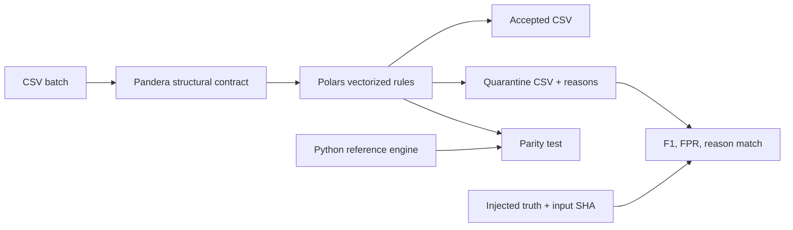

# #26 data-quality-checks

**Benchmark:** `invalid_row_detection_f1` is `1.0000` across three immutable Docker runs; host oracle tests are development feedback, not publication evidence.

**Proves:** a data gate can fail structural corruption closed, quarantine readable rule violations without losing rows, match an independent reference engine, and measure detection quality rather than merely report how dirty its fixture is.

## Run

```bash
docker build -t data-quality-checks:benchmark .
docker run --rm data-quality-checks:benchmark
```

The default path needs no network, secret, database, broker, cloud account, or paid service at runtime.

## Benchmark

| Metric | Value | Unit | Meaning |
|---|---:|---|---|
| Invalid-row F1 | 1.0000 | ratio | precision/recall balance against injected truth |
| Rejected rows | 5.00 | percent | operational quarantine share |
| Exact reason match | 1.0000 | ratio | rejected rows with every expected reason |
| Full-gate throughput | 360,303.53 | rows/s | median across three runs |
| Throughput range | 351,839.30-407,935.11 | rows/s | minimum-maximum across three runs |

Evidence contains three complete 100,000-row runs on one pinned image, all raw outputs, median and range, image ID, and current committed evidence.

### Reproduce The Published Evidence

On PowerShell, after building the image, run the same command three times with N set to 1, 2, and 3, then aggregate the raw outputs:

```powershell
$imageId = docker image inspect data-quality-checks:benchmark --format '{{.Id}}'
$resultDir = (Get-Location).Path + '\benchmarks\results'
1..3 | ForEach-Object {
  docker run --rm -e "IMAGE_ID=$imageId" --mount "type=bind,source=$resultDir,target=/app/benchmarks/results" data-quality-checks:benchmark benchmark --rows 100000 --output "/app/benchmarks/results/run-$_.json"
}
.\tools\aggregate-benchmark.ps1
```

The committed aggregate is benchmarks/results/summary.json; the three raw outputs are run-1.json, run-2.json, and run-3.json.

Image ID: sha256:eae434750a1ae276f8cf17ccf1806c7c8f44c51218e5f9437625ebc0c3017127.
Fixture SHA-256: b19cc048d45ab0db862c0274fda33935d1207043072fa0edd1e1ada691716609.

## Contract And Policy

Structural failures stop the entire batch:

- missing, extra, reordered, or mistyped columns;
- unreadable scalar values;
- duplicate `row_id`;
- invalid output paths.

Readable rows are evaluated by seven explicit rule IDs:

- `identifiers_required`
- `customer_required`
- `quantity_range`
- `unit_price_range`
- `currency_allowed`
- `status_allowed`
- `total_consistent`

Accepted rows are written unchanged. Quarantined rows retain source fields plus ordered `_reasons`. No row is silently dropped.

## Independent Truth

The deterministic fixture injects one invalid row every 20 rows across customer, quantity, currency, total, and status defects. Quantity injection intentionally triggers both range and total-consistency rules. The generator writes the input SHA-256 and expected row/reason map before either engine runs.

Rejected percentage is 5% by fixture design; it is not the primary proof. Precision, recall, F1, false positives, and exact reason match show whether the gate found the known defects without inventing new ones.

## Two Engines, One Contract

- `ReferenceQualityEngine` uses Python's standard library and Decimal as the readable oracle.
- `PolarsPanderaQualityEngine` uses eager Pandera structural validation and native Polars expressions for the measured path.
- Docker tests require exact parity of rejected row IDs, ordered reasons, accepted count, and reason counts.

This is concrete LSP evidence. The optimized adapter cannot silently change policy semantics.

## Gate A File

```bash
data-quality-checks gate orders.csv   --accepted output/accepted.csv   --quarantine output/quarantine.csv
```

## Architecture



Pipeline is the primary architecture because transition order is the main correctness condition. The narrow `QualityEngine` port exists because it is exercised by two substitutable implementations, not to imitate a large clean-architecture template.

## Portfolio System

| Repository | Responsibility | Connection |
|---|---|---|
| #26 `data-quality-checks` | gate raw batches and preserve quarantine | accepted dataset + quality evidence |
| #21 `mlops-end2end` | train, register, promote, and serve | consumes only validated training data |
| #22 `model-drift-detector` | monitor deployed feature/prediction batches | detects distribution change after serving |
| #23 `feature-store-lite` | serve governed features | shares typed feature and freshness expectations |

The codebases remain independent. Contracts and decision skills are synchronized through `portfolio-reuse-kit`.

## Why Not DuckDB Or Great Expectations

DuckDB is excellent when SQL, joins, or persistent analytics are the problem; none is measured here. Great Expectations adds suites, checkpoints, stores, and data docs; those are useful team operations but would hide the small labeled detector proof. Pandera + Polars is the narrower stack.

## Engineering Proof

- Domain, application, and reference engine import no DataFrame or platform framework.
- Structural corruption and row-level quarantine are different outcomes.
- Rules, fixture truth, reference behavior, optimized parity, scoring, and output protection have focused tests.
- Docker uses a non-root user and a Python base pinned by tag and OCI digest.
- OpenSpec records architecture self-challenge, stack rejection, reuse delta, benchmark questions, and release gates.
- Evidence is current for the pinned image and the three completed runs; performance is a local baseline, not a cross-machine guarantee.

## References

See [REFERENCES.md](REFERENCES.md).
