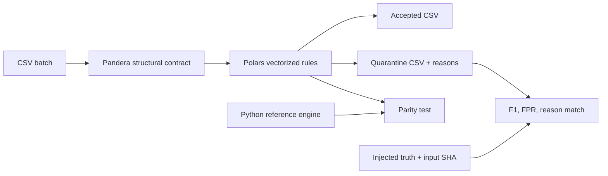

# Data Quality Gate: Fail-Closed Validation with Polars and Pandera

**`invalid_row_detection_f1` is `1.0000`** across three immutable Docker runs of 100,000 rows each, at a median **717,607.98 rows/s**. Structural corruption stops the batch, row-level violations go to quarantine with reasons, and no row is ever silently dropped.

[](https://github.com/Brilhante29/data-quality-checks/actions/workflows/validate.yml)
[](LICENSE)


## Why this exists

Data-quality tools tend to report how dirty a dataset is, which says nothing about whether the checks themselves are right. A gate that flags 5% of rows could be catching every defect or inventing half of them. This repository measures the gate, not the data:

- a deterministic fixture injects known defects and writes the expected row and reason map, plus the input SHA-256, before any engine runs;
- precision, recall, F1, false positives, and exact reason match are scored against that truth;
- structural problems (missing, extra, reordered, or mistyped columns, unreadable values, duplicate `row_id`) fail the whole batch, because partial ingestion of a malformed file is worse than none;
- a readable reference engine and an optimized engine must agree row by row.

## Results

| Metric | Value | Unit | Meaning |
|---|---:|---|---|
| Invalid-row F1 | 1.0000 | ratio | Precision/recall balance against injected truth |
| Rejected rows | 5.00 | percent | Quarantine share, fixed by fixture design |
| Exact reason match | 1.0000 | ratio | Rejected rows with every expected reason |
| Full-gate throughput | 717,607.98 | rows/s | Median across three runs |
| Throughput range | 684,860.81-791,482.53 | rows/s | Minimum to maximum across three runs |
| Full-gate duration | 139.35 | ms | Median read-to-artifact time |

The 5% rejection rate is the fixture's design (one invalid row every 20), not the proof. The proof is that the gate found exactly the injected defects with exactly the expected reasons and invented none.

## Quickstart

```bash
docker build -t data-quality-checks:benchmark .
docker run --rm data-quality-checks:benchmark
```

Gate your own file:

```bash
data-quality-checks gate orders.csv \
  --accepted output/accepted.csv \
  --quarantine output/quarantine.csv \
  --manifest output/validated-batch.json
```

The manifest follows [`contracts/validated-batch-manifest-v1.schema.json`](contracts/validated-batch-manifest-v1.schema.json), binds the accepted and quarantine files by SHA-256, and names the input contract [`contracts/order-batch-v1.contract.json`](contracts/order-batch-v1.contract.json). Downstream repositories consume that artifact, never this repository's Python modules.

Published evidence from a clean commit (PowerShell 7): `./tools/benchmark.ps1`.

## How it works


```mermaid
flowchart LR
    A[CSV batch] --> B[Pandera structural contract]
    B --> C[Polars vectorized rules]
    C --> D[Accepted CSV]
    C --> E[Quarantine CSV + reasons]
    F[Python reference engine] --> G[Parity test]
    C --> G
    H[Injected truth + input SHA] --> I[F1, FPR, reason match]
    E --> I
```

Readable rows are evaluated by seven explicit rules: `identifiers_required`, `customer_required`, `quantity_range`, `unit_price_range`, `currency_allowed`, `status_allowed`, and `total_consistent`. Accepted rows are written unchanged; quarantined rows keep their source fields plus ordered `_reasons`.

### Two engines, one contract

- `ReferenceQualityEngine` uses the Python standard library and `Decimal` as a readable oracle.
- `PolarsPanderaQualityEngine` uses eager Pandera structural validation and native Polars expressions for the measured path.
- Docker tests require exact parity of rejected row IDs, ordered reasons, accepted count, and reason counts, so the fast engine cannot quietly change policy.

## Design decisions

| Decision | Why | Rejected |
|---|---|---|
| Pandera + Polars | Narrow, fast, vectorized, explicit | Great Expectations (suites, stores, and docs would hide the labeled detector proof) |
| No SQL engine | No joins or persistent analytics in scope | DuckDB, excellent when SQL is the problem |
| Reference oracle with parity tests | Optimization cannot change semantics unnoticed | One engine, trusted blindly |
| Fail closed on structure, quarantine on rules | Different failures deserve different outcomes | Dropping bad rows |
| Pipeline with one narrow port | Transition order is the correctness condition; the port has two real implementations | A large clean-architecture template |

## Limitations

- One CSV schema and seven rules; the value is the scored method, not rule coverage.
- Single-node, in-memory processing; datasets larger than memory are out of scope.
- Throughput is a local baseline on one pinned image, not a cross-machine guarantee.

## Reproducibility

- Three complete 100,000-row runs on one pinned image with all raw outputs, median, and range.
- Image ID `sha256:c7c88eb12716707f65479627fc9a9b55fe60d86fbadd68e0194fb427176f27fc`; application wheel `sha256:4a8b27e80de654a18125291e2faedafe33b227c4abbcb7bf88ded42430b4356d`; fixture SHA-256 `b19cc048d45ab0db862c0274fda33935d1207043072fa0edd1e1ada691716609`.
- Publication evidence: [`benchmarks/publication/data-quality-v2.json`](benchmarks/publication/data-quality-v2.json).
- Non-root Docker image, Python base pinned by tag and OCI digest, dependencies constrained transitively and installed only from a wheelhouse built in the pinned stage.

## Project structure

```text
src/data_quality/    domain, reference and Polars/Pandera engines, manifest, fixture, benchmark, CLI
tests/               rules, fixture truth, parity, scoring, and output-protection tests
contracts/           order batch contract and validated-batch manifest schema
benchmarks/  tools/  results, publication harness, validators
sdd/  openspec/      architecture self-challenge, stack rejection, release gates
```

## How this repository is built

The project follows the spec-driven workflow of [portfolio-reuse-kit](https://github.com/Brilhante29/portfolio-reuse-kit). Requirements and decisions live in [`sdd/`](sdd) and [`openspec/`](openspec), and [`project.yaml`](project.yaml) records the architecture, stack, and rejected alternatives. Development is AI-assisted and human-governed: [`AGENTS.md`](AGENTS.md) and [`CLAUDE.md`](CLAUDE.md) hold the coding-agent instructions, while tests, validators, and CI decide what gets published.

## Related work

| Repository | Responsibility | Connection |
|---|---|---|
| data-quality-checks | Gate raw batches and preserve quarantine | Accepted dataset + validated-batch manifest |
| [mlops-end2end](https://github.com/Brilhante29/mlops-end2end) | Train, register, promote, serve | Consumes only validated training data |
| [model-drift-detector](https://github.com/Brilhante29/model-drift-detector) | Monitor deployed feature and prediction batches | Detects distribution change after serving |
| [feature-store-lite](https://github.com/Brilhante29/feature-store-lite) | Serve governed features | Consumes the validated-batch manifest |

See [`REFERENCES.md`](REFERENCES.md) for attribution.

## Author

**Guilherme Brilhante**, software engineer working on scalable backends and production AI.
[LinkedIn](https://www.linkedin.com/in/guilhermefreirebrilhanteseveriano/) · [GitHub](https://github.com/Brilhante29) · [Publications](https://dblp.org/pid/353/6812.html)

## License

[MIT](LICENSE).
